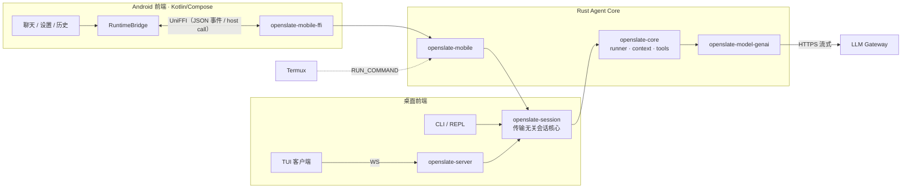

# OpenSlate

**Rust Agent 平台：一套核心，桌面与 Android 双前端。**

桌面端（HTTP+WS 服务端 / TUI / CLI）与 Android 原生 App 共享同一套 Rust Agent Core
（引擎 / 上下文管理 / 工具 / 审批 / 配置），通过传输无关的 `openslate-session`
（`MsgSink` trait）实现复用，desktop 行为零回归。

完整闭环：UI → 会话核心 → LLM 流式回复，支持思维链展示、工具调用
（Android 端经 Termux 执行真实 shell 命令）、多轮记忆与会话断点续聊。

## 特性

### 平台核心（全端共享）

- **会话引擎**：多步工具循环、上下文管理与自动压缩、审批策略、成本统计
- **工具系统**：内置工具 + MCP + 宿主自定义工具（host call 路由）
- **思维链（reasoning）**：随消息持久化、多轮回传、UI 折叠展示
- **usage 诊断接口**：`genai::chat::set_raw_usage_logger` 钩子把 provider 原始
  usage JSON 直达宿主日志（Android logcat / 桌面 tracing），网关字段变化无需抓包
- **多 provider**：OpenAI 兼容 / Anthropic / Gemini（vendor/genai 适配，
  含 anthropic thinking block 与 usage 细分提取补丁）

### 桌面端

- `openslate serve`：共享会话 HTTP+WS 服务端
- TUI：WS attach、自动发现、断线重连的纯客户端
- CLI：`run` / REPL

### Android 端

- Compose App（聊天 / 设置 / 历史 / 前台服务），UniFFI 0.32 proc-macro 绑定，
  事件单队列泵线程回调宿主
- `termux.run` 工具：RUN_COMMAND intent 在 Termux 后台会话执行命令，输出回传进对话
- API Key 存 Android Keystore（AES-GCM），绝不落明文配置，重启自动重注入
- SQLite 会话持久化：重启自动恢复最近会话，历史页切换续聊
- UI：Markdown 渲染、相邻工具调用聚合为圆角矩形容器（chip 独立展开）、
  Step·工具进度、审批横幅、无限时长预算（仅空闲超时兜底）

## 架构



## 仓库布局

```
crates/
  openslate-core/        # 引擎核心：runner / context / tools / types
  openslate-session/     # 传输无关会话核心（全端共用）
  openslate-server/      # 桌面 HTTP+WS 服务端
  openslate-tui/         # 桌面终端 UI
  openslate-cli/         # 桌面命令行
  openslate-mobile/      # Android runtime：事件泵 / host call 路由 / logcat 桥
  openslate-mobile-ffi/  # UniFFI 绑定（proc-macro source 模式）
  openslate-model-genai/ # genai 适配层（reasoning / usage 提取）
vendor/
  genai/                 # genai 0.6.5 补丁：anthropic thinking block 输出、
  #                        usage 细分提取、raw-usage 诊断钩子
  rquickjs-sys/          # 补充 aarch64-linux-android 绑定
android/                 # Compose App（聊天 / 设置 / 历史 / 前台服务）
docs/PLAN-phase1.md      # Android 端 Phase 1 计划书
scripts/                 # APK 构建 / UniFFI 绑定生成脚本
```

## 构建

**桌面端**：workspace 内 `cargo build` / `cargo test` 照常。

**Android 端**（前置：Android SDK + NDK r21、JDK 17、设备已装 Termux 并允许外部调用）：

```bash
# 1. 交叉编译 Rust → arm64（NDK 工具链进 PATH，linker 配置见 android/README.md）
cargo build -p openslate-mobile-ffi --release \
    --target aarch64-linux-android --config <ndk-r21-config.toml>
cp target/aarch64-linux-android/release/libopenslate_mobile.so \
   android/app/src/main/jniLibs/arm64-v8a/

# 2. 打包安装（adb 设备连接时）
scripts/build-apk.sh --install --launch
```

UniFFI 面变更时重跑 `scripts/uniffi-gen.sh` 生成 Kotlin 绑定。

## 测试

全 workspace 约 1500+ 测试通过（Rust 单测 + 集成 + TUI/Server 契约），
含 vendor 补丁的专项单测（`vendor/genai` 可独立 `cargo test`）。

## Roadmap

- [ ] SecretProvider / PlatformPaths 正式化，termux 输出直连（去 PC 中继）
- [ ] thinking effort 参数接入 core → genai 链路
- [ ] Shizuku ADB 权限工具（Android）

## License

MIT
