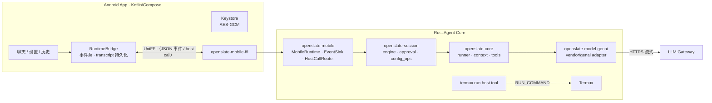

# OpenSlate Mobile

**Android 原生 Host + Rust Agent Core 的移动端 AI Agent 平台。**

完整闭环：Android Compose UI → UniFFI FFI → Rust Agent Core → LLM 流式回复，
支持思维链展示、工具调用（Termux 执行真实 shell 命令）、多轮记忆与会话断点续聊。

## 特性

- **Rust Agent Core 复用**：`openslate-session` 抽取为传输无关的会话核心（`MsgSink` trait），
  桌面端（server/TUI/CLI）与移动端共享同一套引擎、审批与配置逻辑，desktop 行为零回归。
- **UniFFI 桥接**：`openslate-mobile-ffi` 以 proc-macro 模式生成 Kotlin 绑定，
  事件以 JSON 单队列泵线程回调宿主，请求-应答式 host call 路由。
- **思维链（reasoning）**：随消息持久化、多轮回传、折叠 chip 展示（已思考时长 + token 细分，
  细分取决于网关 usage 上报，链路已预留 4 种常见键形态自动提取）。
- **usage 诊断接口**：`genai::chat::set_raw_usage_logger` 钩子把 provider 原始 usage JSON
  直达宿主日志（Android logcat / 桌面 tracing），网关字段变化无需抓包。
- **Termux 工具集成**：`termux.run` 经 RUN_COMMAND intent 在 Termux 后台会话执行命令，
  输出回传进对话（工具卡片可展开查看命令与结果）。
- **密钥安全**：API Key 存 Android Keystore（AES-GCM），绝不落明文配置，重启自动重注入。
- **会话持久化**：SQLite 存储历史 run，重启自动恢复最近会话，可从历史页切换续聊。
- **UI**：Markdown 渲染回复、相邻工具调用聚合为圆角矩形容器（chip 独立展开）、
  Step·工具进度、审批横幅、无限时长预算（仅空闲超时兜底）。

## 架构



## 仓库布局

```
crates/
  openslate-core/        # 引擎核心：runner / context / tools / types
  openslate-session/     # 传输无关会话核心（desktop 与 mobile 共用）
  openslate-server/      # 桌面 HTTP+WS 服务端（复用 session）
  openslate-tui/         # 桌面终端 UI
  openslate-mobile/      # 移动端 runtime：事件泵 / host call 路由 / logcat 桥
  openslate-mobile-ffi/  # UniFFI 0.32 绑定（proc-macro source 模式）
  openslate-model-genai/ # genai 适配层（reasoning / usage 提取）
vendor/
  genai/                 # genai 0.6.5 补丁：anthropic thinking block 输出、
  #                        usage 细分提取、raw-usage 诊断钩子
  rquickjs-sys/          # 补充 aarch64-linux-android 绑定
android/                 # Compose App（聊天 / 设置 / 历史 / 前台服务）
docs/PLAN-phase1.md      # Phase 1 计划书
scripts/                 # APK 构建 / UniFFI 绑定生成脚本
```

## 构建

前置：Rust（stable）、Android SDK + NDK r21（lld）、JDK 17、设备已装 Termux 并允许外部调用。

```bash
# 1. 交叉编译 Rust → arm64（NDK 工具链进 PATH，linker 配置见下方说明）
cargo build -p openslate-mobile-ffi --release \
    --target aarch64-linux-android --config <ndk-r21-config.toml>
cp target/aarch64-linux-android/release/libopenslate_mobile.so \
   android/app/src/main/jniLibs/arm64-v8a/

# 2. 打包安装（adb 设备连接时）
scripts/build-apk.sh --install --launch
```

`ndk-r21-config.toml` 要点：`aarch64-linux-android26-clang` 作 linker、`-fuse-ld=lld`、
空 `libunwind.a` stub 绕过 cargo-ndk 对 r23+ 的要求（详见 `android/README.md`）。
UniFFI 面变更时重跑 `scripts/uniffi-gen.sh` 生成 Kotlin 绑定。

桌面端不受影响：workspace 内 `cargo build` / `cargo test` 照常。

## 测试

全 workspace 约 1500+ 测试通过（Rust 单测 + 集成 + TUI/Server 契约），
含 vendor 补丁的专项单测（`vendor/genai` 可独立 `cargo test`）。

## Roadmap

- [ ] Phase 2：SecretProvider / PlatformPaths 正式化，termux 输出直连（去 PC 中继）
- [ ] thinking effort 参数接入 core → genai 链路
- [ ] Phase 4：Shizuku ADB 权限工具

## License

MIT
